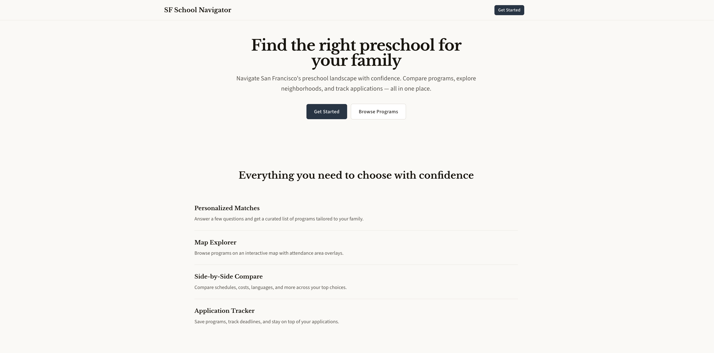

# SF School Navigator

**Helping San Francisco parents navigate 500+ preschool programs with personalized, data-driven recommendations.**

[Live App](https://sf-school-navigator.vercel.app)



---

## The Problem

San Francisco has over 500 early childhood programs -- public Head Start, city-subsidized centers, family childcare homes, SFUSD Pre-K and TK, private Montessori, language immersion, co-ops, and religious schools. Costs range from free to $3,900/month. Waitlists in neighborhoods like Noe Valley and Inner Sunset can stretch over a year.

There is no single place where a parent can see all their options filtered by what actually matters to them. The current process involves cross-referencing the SF Department of Early Childhood's portal, SFUSD's enrollment site, individual school websites, Winnie listings, and Facebook groups.

This project takes that scattered public data and makes it visible in one place.

## What It Does

A parent enters their family's situation -- child's age, neighborhood, budget, schedule needs, language preferences -- and gets a personalized, ranked list of programs that match. Each program has a detailed profile built from public datasets, with clear "last verified" dates so parents know what to trust.

### Key Features

- **Guided intake wizard** -- Captures family constraints (budget, age, schedule, location) through a conversational flow
- **Personalized match scoring** -- Hard filters exclude impossible options; weighted scoring ranks the rest into Strong / Good / Partial tiers
- **Interactive map view** -- Mapbox-powered map with program markers, SFUSD attendance area boundaries, and proximity-based search
- **50+ enriched profiles** -- Detailed program pages with schedules, costs, languages, and application deadlines sourced from public data
- **Side-by-side comparison** -- Compare 2-4 programs across all dimensions
- **Kindergarten path preview** -- Shows how a PreK choice connects to SFUSD kindergarten placement (with policy disclaimers)
- **Deadline tracker with email reminders** -- Never miss an application window
- **400+ basic listings** -- Every licensed program in SF, even without a full profile
- **SEO pages** -- Programmatic pages for every school, optimized for "preschool in [neighborhood]" searches

## Data Pipeline

The Python data pipeline combines three public data sources into a unified, structured database:

| Source | What It Provides |
|--------|-----------------|
| **Community Care Licensing (CCL)** | License status, capacity, age ranges, facility type for every licensed program in SF |
| **SFUSD via DataSF** | Public Pre-K and TK programs, attendance area boundaries, enrollment policies |
| **Program websites** | Schedules, tuition, languages, application deadlines (enrichment layer) |

**Pipeline stages:** Extract (CSV, API, web) --> Transform (normalize, score completeness, generate slugs) --> Load (upsert to Supabase on stable keys) --> Quality (freshness checks, schema validation, diff reports)

Every enriched data field carries provenance tracking -- which source, when it was last verified, and confidence level.

## Privacy Architecture

This project handles family data with a privacy-first approach documented in [PRIVACY.md](PRIVACY.md):

- **Geocode and discard** -- Home addresses are geocoded server-side, then the raw address is thrown away. Only fuzzed coordinates (~200m offset) are stored.
- **Age over DOB** -- Child's age is stored in months, never the exact date of birth.
- **Boolean over free-text** -- Special needs is a flag, not a description.
- **RLS everywhere** -- Dual-layer security: Supabase Row Level Security policies + API-level ownership verification.
- **HMAC-signed unsubscribe tokens** -- Email links use expiring signed tokens, not raw database IDs.

## Tech Stack

| Layer | Technology | Role |
|-------|-----------|------|
| Frontend | Next.js 15, React 19, TypeScript | App Router with SSG, SSR, and streaming |
| Styling | Tailwind CSS 4 | Utility-first CSS |
| Database | Supabase (PostgreSQL + PostGIS) | 14 tables with RLS, geospatial queries |
| Maps | Mapbox GL JS | Interactive maps, geocoding, attendance area polygons |
| Data Pipeline | Python 3.11, Click, Pydantic | ETL from public datasets with quality framework |
| Email | Resend | Transactional deadline reminders |
| Auth | Supabase Auth | Cookie-based sessions |
| Testing | Vitest (frontend), pytest (pipeline) | 9 frontend + 64 pipeline tests |
| Hosting | Vercel | Preview deploys, serverless functions, cron jobs |

## Getting Started

### Prerequisites

- Node.js 18+
- Python 3.11+
- A Supabase project with PostGIS enabled
- Mapbox API key

### Setup

```bash
git clone https://github.com/matthewod11-stack/sf-school-navigator.git
cd sf-school-navigator

# Frontend
cp .env.example .env.local    # Fill in your keys
npm install
npm run dev                    # http://localhost:3000

# Pipeline (optional -- for data ingestion)
cd pipeline
python -m venv .venv
source .venv/bin/activate
pip install -e .
python -m pipeline ccl-import --dry-run --limit 5
```

See [.env.example](.env.example) for required environment variables.

## Project Structure

```
src/                    # Next.js frontend
  app/
    (marketing)/        # Public: homepage, /schools/[slug] SEO pages
    (onboarding)/       # Intake wizard
    (app)/              # Authenticated: /search, /compare, /dashboard
    api/                # Route handlers + cron
  lib/
    scoring/            # Match scoring engine
    supabase/           # Three client pattern (server/admin/public)
    notifications/      # Email reminders with signed unsubscribe
    dates/              # Timezone-safe date handling

pipeline/               # Python data pipeline
  src/pipeline/
    extract/            # CCL, SFUSD, website scrapers
    transform/          # Normalization, cost/schedule parsing
    load/               # Supabase upsert with stable keys
    quality/            # Freshness, schema validation, diffs
```

## Roadmap

See [ROADMAP.md](ROADMAP.md) for the full 26-feature plan across 5 phases. Phases 0-3 are complete. [V2_ROADMAP.md](V2_ROADMAP.md) covers data validation, elementary school expansion, and educational content.

## License

[MIT](LICENSE)

---

Built in San Francisco, for San Francisco parents.
